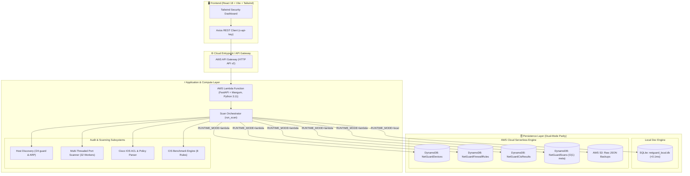

# NetGuard: Network Posture Scanner & CIS Benchmark Auditor

[](https://www.python.org/)
[](https://fastapi.tiangolo.com/)
[](https://reactjs.org/)
[](https://vitejs.dev/)
[](https://tailwindcss.com/)
[](https://aws.amazon.com/)
[-brightgreen.svg)]()
[](https://www.cisecurity.org/)

NetGuard is an automated network posture assessment platform and CIS Cisco IOS compliance auditing engine designed as a high-performance MVP. It discovers live network assets, probes open ports and banners, parses Cisco IOS access control lists (ACLs) and management policies, evaluates security against 8 CIS Benchmark recommendations, ships structured telemetry to AWS, and visualizes posture in a modern React dashboard.

## 🌐 Live Production Deployments

| Component | Platform | Live URL |
| :--- | :--- | :--- |
| **Frontend Dashboard** | Vercel CDN | [https://networkguardian.vercel.app/](https://networkguardian.vercel.app/) |
| **Backend API Gateway** | AWS HTTP API v2 | [https://zrr4hr2xd2.execute-api.us-east-1.amazonaws.com](https://zrr4hr2xd2.execute-api.us-east-1.amazonaws.com) |
| **Health Probe Endpoint** | AWS Lambda | [https://zrr4hr2xd2.execute-api.us-east-1.amazonaws.com/health](https://zrr4hr2xd2.execute-api.us-east-1.amazonaws.com/health) |
| **Swagger API Docs** | AWS Lambda | [https://zrr4hr2xd2.execute-api.us-east-1.amazonaws.com/docs](https://zrr4hr2xd2.execute-api.us-east-1.amazonaws.com/docs) |

## 📖 Complete Documentation Suite


For detailed, deep-dive technical guides, refer to the documentation suite in the `docs/` directory:

| Guide | Description |
| :--- | :--- |
| [01 - Architecture & System Design](docs/01_architecture_and_system_design.md) | Multi-tier topology, engine specifications, composite key schemas, and threat models. |
| [02 - Local Development & Testing Guide](docs/02_local_development_guide.md) | Step-by-step local setup for Windows/macOS/Linux, PowerShell scripts, SQLite DDL, and test suites. |
| [03 - AWS Cloud Production Deployment](docs/03_aws_cloud_deployment_guide.md) | Step 0 login, CLI & Web Console GUI, quick redeploy commands, Free Tier $0.00 economics. |
| [04 - CIS Benchmarks & Compliance](docs/04_cis_benchmarks_and_compliance.md) | Full audit logic, failure criteria, Cisco IOS commands, and remediation steps for all 8 checks. |
| [05 - REST API Reference & Data Schemas](docs/05_api_reference_and_schemas.md) | OpenAPI specification, JSON request/response payloads, authentication, and error models. |
| [06 - Frontend Dashboard & UI](docs/06_frontend_dashboard_and_ui.md) | React 18 component breakdown, state hooks, target presets, and live timer specifications. |
| [07 - Engineering Highlights & Case Studies](docs/07_engineering_highlights_and_case_studies.md) | Problem-solving case studies, performance optimizations, interview talking points, and key architectural moves. |
| [08 - Dual-Mode Data Flow & Execution Guide](docs/08_data_flow_and_runtime_modes.md) | Visual step-by-step data journey, sequence diagrams, and behavioral comparison between Dev and Lambda modes. |

## 🏛️ System Architecture



## ⚡ Dual-Mode Persistence Matrix

NetGuard operates seamlessly in two distinct environments without code branching:

| Feature Dimension | 🖥️ Local Dev Mode (`RUNTIME_MODE=local`) | ☁️ Production Cloud Mode (`RUNTIME_MODE=lambda`) |
| :--- | :--- | :--- |
| **Server Engine** | Local Uvicorn server (`localhost:8000`) | AWS API Gateway + AWS Lambda (`python3.11`) |
| **Database** | Embedded SQLite (`netguard_local.db`) | AWS DynamoDB (4 On-Demand Tables with Pay-Per-Request) |
| **Raw Backups** | Skipped (`"s3": "skipped"`) | Synced to AWS S3 (`"s3": "synced"`) |
| **Scan Scope Limit** | Up to 256 hosts (`/24` subnet) | Up to 16 hosts (Strict 29s timeout guard) |
| **AWS Credentials** | Not required (Runs 100% offline) | Handled automatically via AWS IAM Roles |
| **Error Handling** | Detailed traceback for rapid debugging | Sanitized generic errors (OWASP compliant) |
| **Standing Cost** | $0.00 (Runs on local machine) | $0.00 (100% within AWS Free Tier allowance) |

## 🗄️ DynamoDB Table Schemas

NetGuard uses a multi-table composite key schema that guarantees thread-safety and eliminates write collisions:

| Table Name | Partition Key (HASH) | Sort Key (RANGE) | Billing Mode | Purpose |
| :--- | :--- | :--- | :--- | :--- |
| **`NetGuardDevices`** | `scan_id` (String) | `device_id` (String) | Pay-Per-Request | Stores discovered hosts, open ports, banners, and MAC vendors. |
| **`NetGuardFirewallRules`** | `scan_id` (String) | `rule_id` (String) | Pay-Per-Request | Stores parsed Cisco IOS ACL rules and SNMP policies. |
| **`NetGuardCisResults`** | `scan_id` (String) | `check_id` (String) | Pay-Per-Request | Stores the 8 CIS benchmark evaluations (PASS/FAIL & evidence). |
| **`NetGuardScans`** | `entity_type` (String) | `created_at` (String) | Pay-Per-Request | Reverse-indexed metadata for instant $O(1)$ latest-scan resolution. |

## 🚀 Local Quickstart (Dev Mode)

### 1. Backend Setup

You can start the backend using either the automated PowerShell script (Windows) or standard terminal commands (All OS):

#### Option A: Via PowerShell Script (Windows — Fastest)
```powershell
cd backend
.\run_local.ps1
```

#### Option B: Via Standard CLI (Windows, macOS, Linux)
```powershell
cd backend
python -m venv .venv
.\.venv\Scripts\activate
pip install -r requirements.txt
```

Create `.env` from template:
```powershell
Copy-Item .env.example .env
```

Start the backend:
```powershell
python -m uvicorn app.main:app --host 127.0.0.1 --port 8000 --reload
```
* **Swagger UI Docs**: [http://localhost:8000/docs](http://localhost:8000/docs)
* **Health Check**: [http://localhost:8000/health](http://localhost:8000/health)

Run the test suite (65 passing unit tests):
```powershell
python -m pytest tests/ -v
```

### 2. Frontend Setup

```powershell
cd frontend
pnpm install
Copy-Item .env.example .env
pnpm dev
```
* **Dashboard URL**: [http://localhost:5173](http://localhost:5173)

## ☁️ AWS Cloud Production Deployment

NetGuard is designed to deploy to AWS as a 100% serverless application with **$0.00 monthly standing cost (100% Free Tier compliant)**.

For the complete, step-by-step production deployment guide (including Step 0 IAM user creation, CLI login, AWS Web Console GUI instructions, Python 3.11 Linux packaging, and API Gateway integration), refer to the dedicated guide:

👉 **[Read the Full AWS Cloud Deployment Guide (docs/03_aws_cloud_deployment_guide.md)](docs/03_aws_cloud_deployment_guide.md)**

### Quick Summary of Cloud Infrastructure:
* **AWS Lambda**: Serverless execution using FastAPI + Mangum (`NetGuardScanner`, Python 3.11).
* **AWS DynamoDB**: 4 On-Demand tables (`NetGuardDevices`, `NetGuardFirewallRules`, `NetGuardCisResults`, `NetGuardScans`).
* **AWS S3**: Private encrypted audit backup bucket (`netguard-raw-results-<account_id>`).
* **AWS API Gateway**: HTTP API v2 integration providing global HTTPS endpoints.

### Live Production Endpoints:
* **Live API Endpoint**: `https://zrr4hr2xd2.execute-api.us-east-1.amazonaws.com`
* **Health Probe**: `https://zrr4hr2xd2.execute-api.us-east-1.amazonaws.com/health`
* **Swagger API Docs**: `https://zrr4hr2xd2.execute-api.us-east-1.amazonaws.com/docs`
* **Deployed Dashboard**: `https://networkguardian.vercel.app/`

## 🛡️ CIS Cisco IOS 16 Benchmark Mappings


| Check ID | Description | CIS Recommendation |
| :--- | :--- | :--- |
| `check_insecure_mgmt_protocols` | Flags Telnet, FTP, HTTP, and SNMPv1/v2c | Recommendation 2.3.1 |
| `check_ssh_only_mgmt` | Enforces SSH-only management restricted to management subnets | Recommendation 2.3.5 |
| `check_weak_snmp_community` | Flags `public` or `private` SNMP community strings | Recommendation 2.4.1 |
| `check_open_ingress_sensitive_ports` | Flags ingress permits from `any` to ports 22, 23, 3389, 445, 3306, 5432 | Recommendation 2.2.3 |
| `check_egress_default_deny` | Requires explicit default-deny (`deny ip any any`) rule on egress ACLs | Recommendation 2.2.6 |
| `check_remote_syslog_enabled` | Requires configured `logging host <ip>` remote syslog collector | Recommendation 3.1.1 |
| `check_no_default_credentials_banner` | Requires non-empty `banner login` block | Recommendation 1.1.7 |
| `check_ntp_configured` | Requires configured `ntp server <ip>` time synchronization | Recommendation 3.2.1 |

## 👨‍💻 Author & Maintainer

* **Author**: Ujjwal Saini ([@UjjwalSaini07](https://github.com/UjjwalSaini07))
* **Portfolio**: [https://ujjwalsaini.vercel.app/](https://ujjwalsaini.vercel.app/)
* **LinkedIn**: [linkedin.com/in/ujjwalsaini07](https://linkedin.com/in/ujjwalsaini07)
* **Email**: [ujjwalsaini0007+netguard@gmail.com](mailto:ujjwalsaini0007+netguard@gmail.com)

## 📄 License
This project is licensed under the Mozilla Public License Version 2.0 (MPL-2.0) — see the [LICENSE](LICENSE) file for details.


