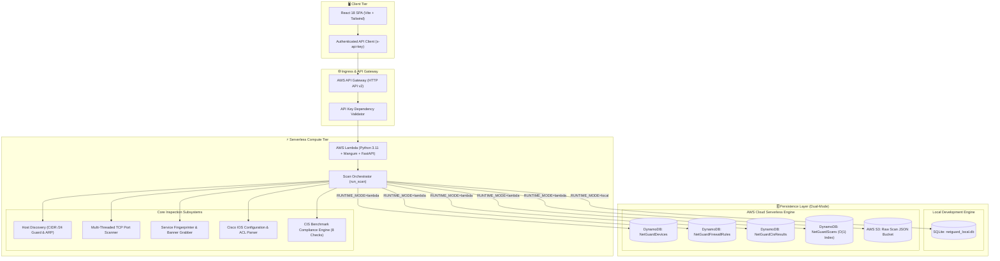
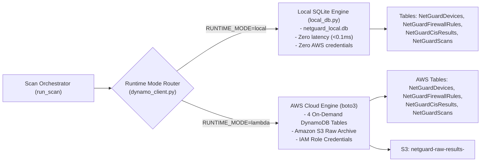
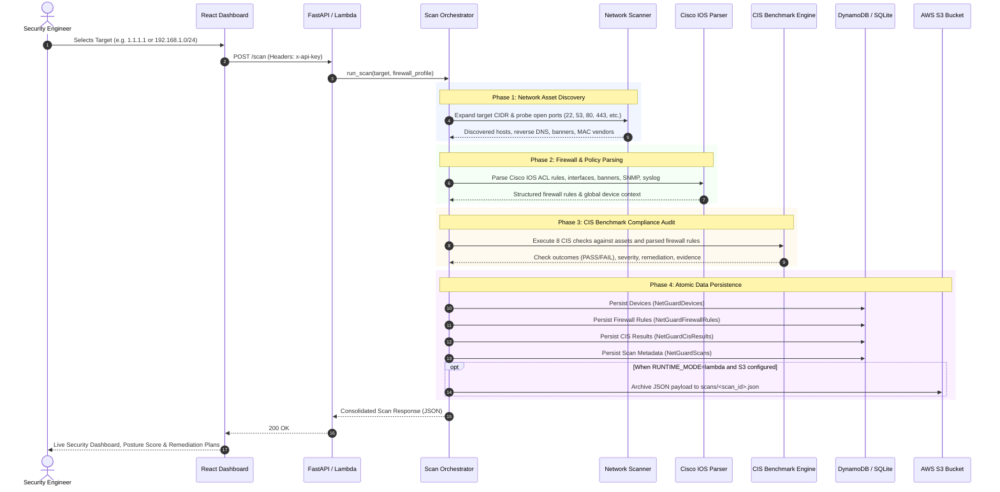
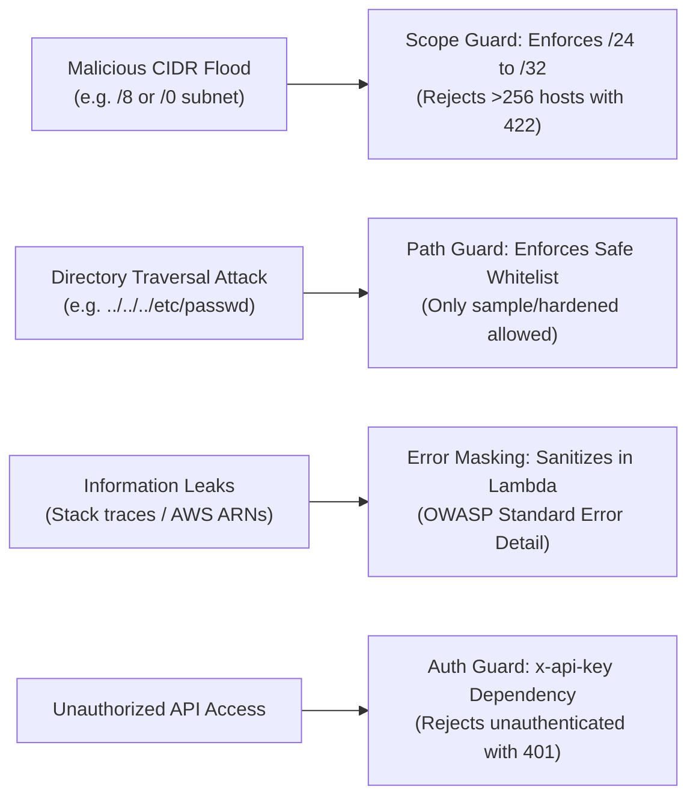

# 01 - Architecture & System Design Specification

## Executive Summary
NetGuard is an automated network posture assessment platform and CIS Cisco IOS compliance auditing engine designed as a cloud-native, serverless MVP. It provides end-to-end security auditing: discovering live network assets, fingerprinting open ports and services, parsing Cisco IOS access control lists (ACLs) and management configurations, evaluating compliance against 8 CIS Benchmark recommendations, and persisting results in a high-performance dual-storage architecture.

## System Topology & Component Interaction

## Detailed Subsystem Specifications

### 1. Host Discovery Engine (`host_discovery.py`)
* **Target Expansion**: Ingests IPv4 strings, comma-separated host lists, or CIDR network blocks. Validates and expands CIDRs using Python's `ipaddress` standard library.
* **Scope Boundary Guard**: Rejects subnets wider than `/24` (max 256 addresses) up front to prevent resource exhaustion and gateway timeouts.
* **Dual-Mechanism Reachability Probing**:
  * **Primary Mechanism (TCP Socket Probing)**: Probes candidates across an expanded set of standard ports: `[80, 443, 22, 53, 8080, 8443, 21, 25]`. Unlike ICMP ping, TCP socket probing functions seamlessly inside restricted sandbox containers like AWS Lambda (which blocks raw ICMP sockets).
  * **Fallback Mechanism (ICMP Echo)**: If all TCP probes fail, executes an OS ping with a strict 1-second timeout.
* **ARP MAC & Vendor Resolution**: Reads the operating system's ARP cache (supporting both Windows `arp -a` and Linux `arp -an` format parsers), extracting hardware MAC addresses and mapping IEEE Organizationally Unique Identifiers (OUIs) to hardware vendors.
* **Reverse DNS Resolution**: Performs non-blocking PTR lookups via `socket.gethostbyaddr` to capture fully qualified domain names (FQDNs).

### 2. Multi-Threaded Port Scanner & Service Detector (`port_scanner.py`)
* **Worker Pool Architecture**: Utilizes a `ThreadPoolExecutor` with controlled concurrency (default: 32 workers) to probe high-priority service ports (21 FTP, 22 SSH, 23 Telnet, 53 DNS, 80 HTTP, 443 HTTPS, 445 SMB, 3306 MySQL, 3389 RDP, 5432 PostgreSQL, 8080 HTTP-Alt).
* **Banner Grabbing**: Dispatches protocol-specific probes upon connection establishment (e.g. sending `HEAD / HTTP/1.1\r\n\r\n` to web ports, reading SSH identification strings, capturing Telnet negotiation bytes).
* **Service Signatures**: Matches captured raw banners against known software signatures (e.g. `cloudflare`, `OpenSSH`, `nginx`, `Apache`, `Cisco IOS`).

### 3. Cisco IOS Configuration & ACL Parser (`cisco_parser.py`)
* **Lexer & Grammar Parser**: Ingests raw Cisco IOS running-config text files and builds an Abstract Syntax Tree (AST) representing the firewall state.
* **Standard & Extended ACL Parsing**:
  * Supports numbered ACLs (`access-list 1..99`, `access-list 100..199`) and named extended ACLs (`ip access-list extended <name>`).
  * Normalizes actions (`permit` vs `deny`), protocols (`tcp`, `udp`, `ip`, `icmp`), source and destination addresses.
* **Wildcard Mask Inversion**: Bitwise inverts Cisco wildcard masks (e.g. `0.0.0.255` inverted becomes netmask `255.255.255.0` or CIDR `/24`), allowing CIDR-based subnet inclusion calculations.
* **Interface & Directional Tagging**: Traverses interface configuration blocks (`interface GigabitEthernet0/0`) and maps applied access groups (`ip access-group <name> in|out`) to assign `ingress` vs `egress` directional metadata to rules.
* **Global Security Directives**: Extracts `banner login`, `logging host <ip>`, `ntp server <ip>`, `snmp-server community <string>`, and VTY `transport input <protocols>`.

### 4. CIS Benchmark Compliance Engine (`benchmarks/engine.py`)
* **Deterministic Rule Evaluator**: Implements a static, explicit registry of 8 benchmark checks mapped directly to the CIS Cisco IOS 16 Benchmark.
* **Zero Reflection**: Avoids dynamic Python module inspection for security and predictability.
* **Telemetry Generation**: Every check returns a structured `CisCheckOutcome` containing:
  * `check_id` (e.g. `check_ssh_only_mgmt`)
  * `status` (`PASS` or `FAIL`)
  * `evidence` (Human-readable explanation of findings)
  * `affected_items` (Offending configuration lines, open ports, or vulnerable IP addresses)
  * `remediation` (Exact Cisco IOS CLI commands to remediate the vulnerability)
  * `severity` (`CRITICAL`, `HIGH`, `MEDIUM`, `LOW`)

## Dual-Mode Persistence Architecture

### Table Schema & Partition Key Specifications

| Table Name | Partition Key (HASH) | Sort Key (RANGE) | Billing Mode | Purpose |
| :--- | :--- | :--- | :--- | :--- |
| **`NetGuardDevices`** | `scan_id` (String) | `device_id` (String) | Pay-Per-Request | Stores discovered hosts, open ports, banners, and MAC vendors. |
| **`NetGuardFirewallRules`** | `scan_id` (String) | `rule_id` (String) | Pay-Per-Request | Stores parsed Cisco IOS ACL rules and SNMP policies. |
| **`NetGuardCisResults`** | `scan_id` (String) | `check_id` (String) | Pay-Per-Request | Stores the 8 CIS benchmark evaluations (PASS/FAIL & evidence). |
| **`NetGuardScans`** | `entity_type` (String) | `created_at` (String) | Pay-Per-Request | Reverse-indexed metadata for instant $O(1)$ latest-scan resolution. |

### Why We Use Composite Keys:
A single sweep discovers dozens of devices, parses dozens of ACL rules, and generates 8 CIS benchmark results. Using `scan_id` as the partition key and entity UUID/check_id as the sort key guarantees that items within the same scan never overwrite sibling items.

### Instant $O(1)$ Latest Scan Resolution:
In `NetGuardScans`, all scan records share a constant partition key (`entity_type="SCAN"`) with an ISO-8601 timestamp sort key (`created_at`). Executing a `Query` with `ScanIndexForward=False` and `Limit=1` resolves the latest scan ID in **$O(1)$ constant time ($<5\text{ms}$)** without performing expensive full table scans.

## End-to-End Execution Sequence Diagram

## Security & Threat Model

### 1. Scope Flood Protection
An attacker attempting to cause denial-of-service by submitting a wide CIDR block (e.g. `0.0.0.0/0` expanding to 4.2 billion IPs) is immediately blocked at both the React frontend and Pydantic schema validation layer before any network sockets are allocated.

### 2. Path Traversal Protection
The Cisco configuration parser validates profile paths against an explicit allowlist (`sample`, `hardened`, `insecure`). Any path containing directory traversal sequences (`..`, `/`, `\`) is rejected with HTTP 422.

### 3. OWASP-Compliant Error Sanitization
* **In Local Mode**: Full tracebacks are returned to the developer for debugging.
* **In Production Lambda Mode**: Unhandled exceptions and database errors are replaced with safe generic messages (`"Security sweep failed. Check network connectivity or service logs."`) while streaming the full traceback internally to Amazon CloudWatch.

### 4. Principle of Least Privilege (IAM Role)
The Lambda execution role (`NetGuardLambdaRole`) is granted strictly scoped permissions to only read/write from the 4 NetGuard DynamoDB tables and PUT objects into the designated NetGuard S3 raw results bucket.
