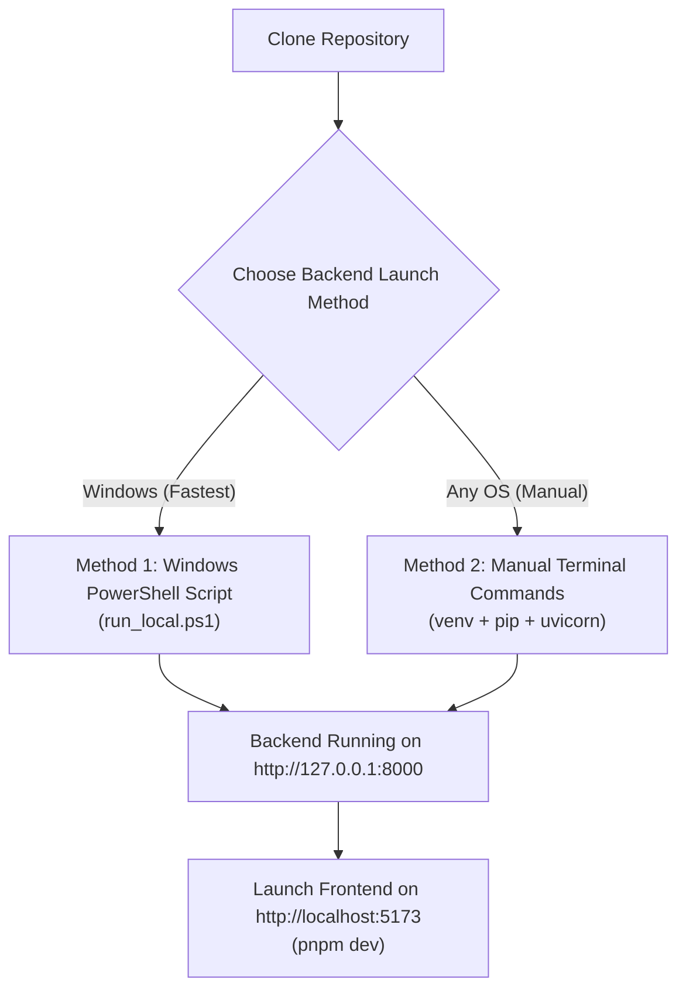

# 02 - Local Development & Testing Guide

## Overview
This document provides complete instructions for running, testing, and debugging NetGuard locally on Windows, macOS, and Linux. In local development mode, NetGuard operates completely offline using an embedded SQLite database (`netguard_local.db`), requiring zero AWS accounts, cloud credentials, or internet access.

## Prerequisites & Tooling
* **Python**: Version 3.11, 3.12, or 3.13 installed (`python --version`)
* **Node.js**: Version 18+ or 20+ installed (`node --version`)
* **pnpm**: Fast, disk-efficient package manager (`pnpm --version` or `npm install -g pnpm`)
* **Git**: Installed for version control

## Backend Setup Methods



### Method 1: Automated Windows PowerShell Script (Fastest)

NetGuard includes an automated PowerShell script that creates the virtual environment, installs dependencies, verifies the `.env` file, and boots Uvicorn with auto-reloading.

1. Open PowerShell and navigate to the backend directory (from repository root):
   ```powershell
   cd backend
   ```

2. Run the script:
   ```powershell
   .\run_local.ps1
   ```

The script automatically starts the FastAPI server at `http://127.0.0.1:8000`.

### Method 2: Manual CLI Setup (Windows, macOS, Linux)

If you prefer to configure the environment step-by-step or are running on macOS/Linux:

1. Navigate to the backend directory:
   ```bash
   cd backend
   ```

2. Create and activate a Python virtual environment:
   * **Windows (PowerShell)**:
     ```powershell
     python -m venv .venv
     .\.venv\Scripts\activate
     ```
   * **Windows (Command Prompt / CMD)**:
     ```cmd
     python -m venv .venv
     .venv\Scripts\activate.bat
     ```
   * **macOS / Linux**:
     ```bash
     python3 -m venv .venv
     source .venv/bin/activate
     ```

3. Install required dependencies:
   ```bash
   pip install -r requirements.txt
   ```

4. Create your local environment file (`.env`) from the template:
   * **Windows (PowerShell)**:
     ```powershell
     Copy-Item .env.example .env
     ```
   * **Windows (Command Prompt / CMD)**:
     ```cmd
     copy .env.example .env
     ```
   * **macOS / Linux**:
     ```bash
     cp .env.example .env
     ```

> [!IMPORTANT]
> The repository includes `.env.example` as a committed configuration template, while `.env` is gitignored to prevent credentials from leaking to source control. The default values in `.env` (`RUNTIME_MODE=local`, `NETGUARD_API_KEY=changeme-local-dev-key`, `LOG_LEVEL=INFO`) work immediately for local offline execution with embedded SQLite.

5. Launch the Uvicorn ASGI server:
   ```bash
   python -m uvicorn app.main:app --host 127.0.0.1 --port 8000 --reload
   ```

## Backend Verification & Endpoints

Once running, verify your local backend with these URLs:
* **Interactive API Docs (Swagger UI)**: [http://localhost:8000/docs](http://localhost:8000/docs)
* **ReDoc API Reference**: [http://localhost:8000/redoc](http://localhost:8000/redoc)
* **Health Check Endpoint**: [http://localhost:8000/health](http://localhost:8000/health)

Expected response from `/health`:
```json
{
  "status": "ok",
  "dynamodb": "ok",
  "runtime_mode": "local",
  "aws_region": "local",
  "version": "1.0.0",
  "uptime_seconds": 1.25,
  "services": {
    "database": "ok",
    "benchmark_engine": "ok",
    "host_discovery": "ok"
  }
}
```

## Frontend Setup & Execution

1. Open a new terminal and navigate to the frontend directory:
   ```bash
   cd frontend
   ```

2. Install Node dependencies using pnpm:
   ```bash
   pnpm install
   ```

3. Create the frontend environment configuration (`.env`) from template:
   * **Windows (PowerShell)**:
     ```powershell
     Copy-Item .env.example .env
     ```
   * **Windows (Command Prompt / CMD)**:
     ```cmd
     copy .env.example .env
     ```
   * **macOS / Linux**:
     ```bash
     cp .env.example .env
     ```

> [!IMPORTANT]
> Verify that `VITE_NETGUARD_API_KEY` in `frontend/.env` matches `NETGUARD_API_KEY` from `backend/.env` (default: `changeme-local-dev-key`). The frontend sends this key in the `x-api-key` header to authenticate all API requests.

4. Start the Vite development server:
   ```bash
   pnpm dev
   ```


5. Open your browser and navigate to:
   [http://localhost:5173](http://localhost:5173)

## Running the Automated Test Suite

NetGuard features a comprehensive unit and integration test suite covering all API routes, CIS benchmark evaluation rules, Cisco IOS ACL parsing, host discovery, ARP parsing, and error sanitization.

### Run All Tests:
```powershell
python -m pytest backend/tests/ -v
```

### Run Specific Test Modules:
* **API Route & Persistence Tests**:
  ```powershell
  python -m pytest backend/tests/test_api_routes.py -v
  ```
* **CIS Benchmark Rules Tests**:
  ```powershell
  python -m pytest backend/tests/test_benchmarks.py -v
  ```
* **Cisco IOS Firewall Parser Tests**:
  ```powershell
  python -m pytest backend/tests/test_firewall_parser.py -v
  ```
* **Host & Port Discovery Tests**:
  ```powershell
  python -m pytest backend/tests/test_host_discovery.py backend/tests/test_port_scanner.py -v
  ```

## Local SQLite Database Schema & Inspection

In local development mode (`RUNTIME_MODE=local`), all scans, discovered hosts, parsed ACL rules, and benchmark outcomes are persisted inside `backend/netguard_local.db`.

### Why We Choose SQLite for Local Development:
1. **Zero External Dependencies / Zero Docker**: Developers do not need to install Docker, start database daemon containers, or configure local DynamoDB emulators. Everything runs instantly with standard Python.
2. **Sub-Millisecond Write Speeds ($<0.1\text{ms}$)**: Writing a full `/24` subnet scan (254 device items) executes directly in local disk storage without network latency or AWS throttling.
3. **100% Offline Resilience**: Enables auditing and feature development anywhere—even completely disconnected from the internet or on restricted internal corporate networks.
4. **Exact Composite Key Schema Parity**: Uses composite primary keys (`(scan_id, device_id)`, `(scan_id, rule_id)`, `(scan_id, check_id)`), ensuring identical data access patterns and test behavior as AWS DynamoDB.
5. **Local Data Isolation & Security**: Private network topology scans of local subnets remain strictly on the developer's workstation and are never transmitted to cloud storage during development.

### SQLite Schema Parity with AWS DynamoDB:

The SQLite database implements the exact same composite primary key strategy (`scan_id` + entity ID) as AWS DynamoDB, ensuring 100% data model consistency across dev and cloud:

| SQLite Table | Primary Key | Columns | Purpose |
| :--- | :--- | :--- | :--- |
| **`devices`** | `(scan_id, device_id)` | `scan_id TEXT`, `device_id TEXT`, `item_json TEXT` | Stores discovered hosts, open ports, banners, and MAC vendors. |
| **`firewall_rules`** | `(scan_id, rule_id)` | `scan_id TEXT`, `rule_id TEXT`, `item_json TEXT` | Stores parsed Cisco IOS ACL rules and SNMP policies. |
| **`cis_results`** | `(scan_id, check_id)` | `scan_id TEXT`, `check_id TEXT`, `item_json TEXT` | Stores the 8 CIS benchmark evaluations (PASS/FAIL & evidence). |
| **`scans`** | `scan_id` | `scan_id TEXT`, `entity_type TEXT`, `created_at TEXT`, `target TEXT`, `status TEXT`, `summary TEXT` | Stores scan metadata with reverse-chronological ordering support. |

### Complete SQLite DDL Definitions:
```sql
CREATE TABLE IF NOT EXISTS devices (
    scan_id TEXT,
    device_id TEXT,
    item_json TEXT,
    PRIMARY KEY (scan_id, device_id)
);

CREATE TABLE IF NOT EXISTS firewall_rules (
    scan_id TEXT,
    rule_id TEXT,
    item_json TEXT,
    PRIMARY KEY (scan_id, rule_id)
);

CREATE TABLE IF NOT EXISTS cis_results (
    scan_id TEXT,
    check_id TEXT,
    item_json TEXT,
    PRIMARY KEY (scan_id, check_id)
);

CREATE TABLE IF NOT EXISTS scans (
    scan_id TEXT PRIMARY KEY,
    entity_type TEXT,
    created_at TEXT,
    target TEXT,
    status TEXT,
    summary TEXT
);
```

### Inspecting Local Data via Python CLI:
You can query and inspect the local database using Python directly from the project root:
```powershell
python -c "import sqlite3; conn = sqlite3.connect('backend/netguard_local.db'); print('Tables:', [r[0] for r in conn.cursor().execute(\"SELECT name FROM sqlite_master WHERE type='table';\").fetchall()]); print('Total scans:', conn.cursor().execute('SELECT COUNT(*) FROM scans;').fetchone()[0]); print('Total devices discovered:', conn.cursor().execute('SELECT COUNT(*) FROM devices;').fetchone()[0]); conn.close()"
```


## Local Development Troubleshooting

### 1. Port 8000 Already in Use
If another process is using port 8000:
* **Windows (PowerShell)**:
  ```powershell
  Get-Process -Id (Get-NetTCPConnection -LocalPort 8000).OwningProcess | Stop-Process -Force
  ```
* **Linux / macOS**:
  ```bash
  lsof -ti:8000 | xargs kill -9
  ```

### 2. PowerShell Script Execution Policy Error
If running `.\run_local.ps1` gives an execution policy error:
```powershell
Set-ExecutionPolicy -ExecutionPolicy RemoteSigned -Scope CurrentUser
```

### 3. Frontend Cannot Connect to Backend
* Verify `VITE_API_BASE_URL` in `frontend/.env` matches `http://127.0.0.1:8000`.
* Ensure `VITE_NETGUARD_API_KEY` matches `NETGUARD_API_KEY` in `backend/.env`.
