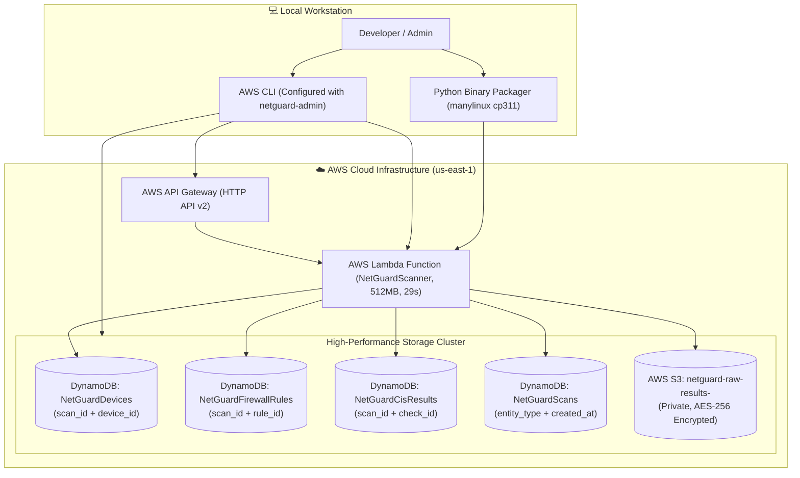
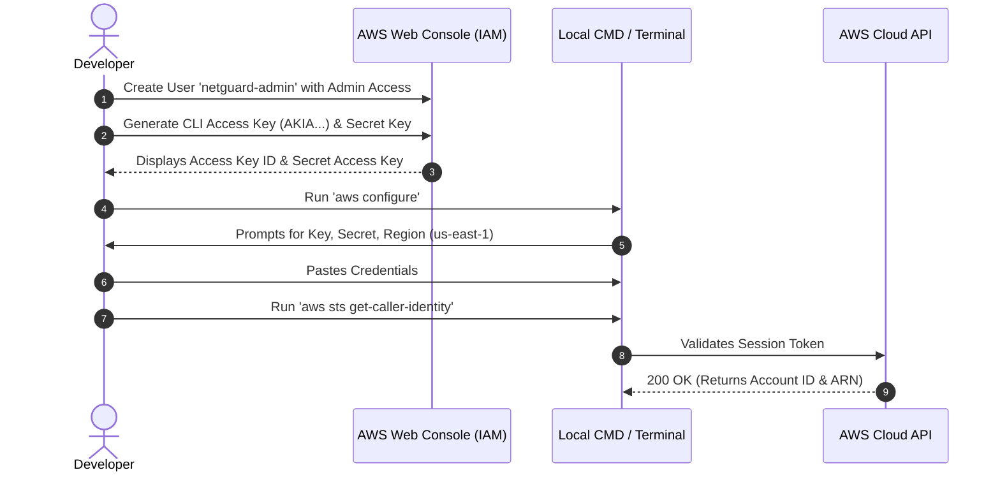

# 03 - AWS Cloud Production Deployment Guide

## Overview & Architecture
This guide provides an end-to-end, zero-assumption walkthrough for deploying NetGuard to AWS as an enterprise-grade serverless application. It is specifically designed to run 100% within the **AWS Free Tier ($0.00 monthly standing cost)**.



## Why AWS Serverless & Free Tier Economics

### Why We Choose This Architecture:
1. **Zero Idle Server Cost ($0.00)**: Unlike traditional EC2 virtual machines or containers (ECS/EKS) that charge you 24/7 even when no scans are running, AWS Lambda and DynamoDB On-Demand only run when an API request arrives. When idle, cost is strictly $0.00.
2. **Instant Scaling**: Lambda automatically scales to handle simultaneous audit requests and spins down immediately.
3. **No Infrastructure Maintenance**: Zero OS patching, kernel upgrades, or web server maintenance required.

### Free Tier Allowance Breakdown:
* **AWS Lambda**: 1,000,000 requests and 3,200,000 seconds of compute time per month **forever free**.
* **AWS DynamoDB**: 25 GB of storage and 2.5 million read/write requests per month **forever free** in on-demand mode (`PAY_PER_REQUEST`).
* **AWS S3**: 5 GB of standard storage and 20,000 GET / 2,000 PUT requests per month free.
* **AWS API Gateway**: 1,000,000 HTTP API calls per month free.

## Step 0: Installing & Authenticating AWS CLI from Scratch

Before deploying, your local machine must be authenticated with AWS. Follow these exact steps to create your admin credentials and log in.

### 0.1 Install AWS CLI on Your Computer
If you do not have the AWS CLI installed, install it:
* **Windows (Command Prompt / PowerShell)**:
  ```cmd
  winget install Amazon.AWSCLI
  ```
  *(Restart your Command Prompt or PowerShell terminal after installation completes).*
* **macOS**:
  ```bash
  brew install awscli
  ```
* **Linux (Ubuntu/Debian)**:
  ```bash
  sudo apt-get update && sudo apt-get install awscli -y
  ```

### 0.2 Create the IAM User in AWS Web Console
1. Open the [AWS Management Console](https://console.aws.amazon.com/) in your browser and sign in.
2. In the top search bar, type `IAM` and click on **IAM (Identity and Access Management)**.
3. In the left navigation menu, click **Users** and click the orange **Create user** button.
4. Set the **User name** to `netguard-admin` and click **Next**.
5. Under **Permissions options**, select **Attach policies directly**.
6. Check the box for **`AdministratorAccess`** (or attach `AmazonDynamoDBFullAccess`, `AWSLambda_FullAccess`, `AmazonAPIGatewayAdministrator`, and `IAMFullAccess`).
7. Click **Next** and click **Create user**.



### 0.3 Generate Access Keys for CLI
1. In the IAM Users table, click on your newly created `netguard-admin` user.
2. Click the **Security credentials** tab.
3. Scroll down to the **Access keys** section and click **Create access key**.
4. Select **Command Line Interface (CLI)**, check the confirmation acknowledgment box, and click **Next**.
5. Click **Create access key**.
6. **Crucial**: Copy both values:
   * **Access key ID** (starts with `AKIA...`)
   * **Secret access key** (long confidential string)

### 0.4 Login Locally via `aws configure`
Open **Command Prompt (CMD)** or **PowerShell** on your local machine and run:
```cmd
aws configure
```

Enter your details when prompted:
```text
AWS Access Key ID [None]: AKIAYOURACCESSKEYIDHERE
AWS Secret Access Key [None]: yourSecretAccessKeyStringHere12345
Default region name [None]: us-east-1
Default output format [None]: json
```

### 0.5 Verify Connection
Verify that your local terminal is successfully connected:
```cmd
aws sts get-caller-identity
```

Expected output:
```json
{
    "UserId": "AIDA4PGN5EBKWDRBB3URI",
    "Account": "857277800533",
    "Arn": "arn:aws:iam::857277800533:user/netguard-admin"
}
```

## Step 1: Create the 4 DynamoDB Tables

### Why We Use 4 Dedicated Tables with Composite Keys:
* **`NetGuardDevices`**: A single scan discovers dozens of hosts. Using `scan_id` (HASH) + `device_id` (RANGE) prevents hosts in the same scan from overwriting one another.
* **`NetGuardFirewallRules`**: Uses `scan_id` (HASH) + `rule_id` (RANGE) to store parsed ACL entries independently.
* **`NetGuardCisResults`**: Uses `scan_id` (HASH) + `check_id` (RANGE). Because `check_id` is constant (e.g. `check_ssh_only_mgmt`), evaluating historical trends per check across scans is seamless.
* **`NetGuardScans`**: Uses `entity_type` (HASH) + `created_at` (RANGE). This provides an instant $O(1)$ query to resolve the latest scan ID in production without scanning entire device tables.

### Option A: Via AWS CLI (Single Commands)
Run these commands in your Command Prompt (CMD) or PowerShell:

```cmd
aws dynamodb create-table --table-name NetGuardDevices --attribute-definitions AttributeName=scan_id,AttributeType=S AttributeName=device_id,AttributeType=S --key-schema AttributeName=scan_id,KeyType=HASH AttributeName=device_id,KeyType=RANGE --billing-mode PAY_PER_REQUEST --region us-east-1
```

```cmd
aws dynamodb create-table --table-name NetGuardFirewallRules --attribute-definitions AttributeName=scan_id,AttributeType=S AttributeName=rule_id,AttributeType=S --key-schema AttributeName=scan_id,KeyType=HASH AttributeName=rule_id,KeyType=RANGE --billing-mode PAY_PER_REQUEST --region us-east-1
```

```cmd
aws dynamodb create-table --table-name NetGuardCisResults --attribute-definitions AttributeName=scan_id,AttributeType=S AttributeName=check_id,AttributeType=S --key-schema AttributeName=scan_id,KeyType=HASH AttributeName=check_id,KeyType=RANGE --billing-mode PAY_PER_REQUEST --region us-east-1
```

```cmd
aws dynamodb create-table --table-name NetGuardScans --attribute-definitions AttributeName=entity_type,AttributeType=S AttributeName=created_at,AttributeType=S --key-schema AttributeName=entity_type,KeyType=HASH AttributeName=created_at,KeyType=RANGE --billing-mode PAY_PER_REQUEST --region us-east-1
```

### Option B: Via AWS Management Web Console (GUI)
If you prefer creating the tables using the browser interface:
1. Open the [AWS DynamoDB Console](https://us-east-1.console.aws.amazon.com/dynamodbv2/home?region=us-east-1#tables).
2. Click **Create table** and create the 4 tables:
   * **Table 1**: Name = `NetGuardDevices`, Partition Key = `scan_id` (String), Sort Key = `device_id` (String).
   * **Table 2**: Name = `NetGuardFirewallRules`, Partition Key = `scan_id` (String), Sort Key = `rule_id` (String).
   * **Table 3**: Name = `NetGuardCisResults`, Partition Key = `scan_id` (String), Sort Key = `check_id` (String).
   * **Table 4**: Name = `NetGuardScans`, Partition Key = `entity_type` (String), Sort Key = `created_at` (String).
3. For each table, scroll to **Table settings**, select **Customize settings**, change the Capacity mode to **On-demand** (`PAY_PER_REQUEST`), and click **Create table**.

## Step 2: Create & Secure the S3 Raw Archive Bucket

### Why We Use S3 & Block Public Access:
* Complete scan payloads (including raw port banners, Cisco IOS ACL texts, and full test evidence) are saved as timestamped JSON objects (`scans/<scan_id>.json`) for audit compliance and long-term historical backups.
* S3 Block Public Access guarantees that network security audit data is never exposed publicly to the internet.

Replace `YOUR_ACCOUNT_ID` with your 12-digit AWS account number (e.g. `857277800533`):

### Create Bucket:
```cmd
aws s3api create-bucket --bucket netguard-raw-results-YOUR_ACCOUNT_ID --region us-east-1
```

### Enable Strict Public Access Blocking:
```cmd
aws s3api put-public-access-block --bucket netguard-raw-results-YOUR_ACCOUNT_ID --public-access-block-configuration "BlockPublicAcls=true,IgnorePublicAcls=true,BlockPublicPolicy=true,RestrictPublicBuckets=true"
```

## Step 3: Create the IAM Role for Lambda

### Why Lambda Needs an Execution Role:
AWS Lambda functions run with least-privilege security. The execution role grants the Lambda function temporary IAM credentials to write audit records to DynamoDB, upload JSON backups to S3, and stream application logs to Amazon CloudWatch.

### 1. Create the Lambda Execution Role:
```cmd
aws iam create-role --role-name NetGuardLambdaRole --assume-role-policy-document "{\"Version\":\"2012-10-17\",\"Statement\":[{\"Effect\":\"Allow\",\"Principal\":{\"Service\":\"lambda.amazonaws.com\"},\"Action\":\"sts:AssumeRole\"}]}"
```

### 2. Attach Required Policies:
```cmd
aws iam attach-role-policy --role-name NetGuardLambdaRole --policy-arn arn:aws:iam::aws:policy/service-role/AWSLambdaBasicExecutionRole
aws iam attach-role-policy --role-name NetGuardLambdaRole --policy-arn arn:aws:iam::aws:policy/AmazonDynamoDBFullAccess
aws iam attach-role-policy --role-name NetGuardLambdaRole --policy-arn arn:aws:iam::aws:policy/AmazonS3FullAccess
```

## Step 4: Package Application Code (Python 3.11 Linux Binaries)

### Why Linux Binaries (`manylinux`) Are Critical:
AWS Lambda runs on Amazon Linux (x86_64). When building on a Windows workstation, native Python dependencies with compiled C-extensions (such as `pydantic_core` and `httptools`) will install Windows `.pyd` DLLs instead of Linux `.so` shared libraries, causing `ImportError: No module named 'pydantic_core._pydantic_core'` in Lambda. 

We resolve this by using `pip` with `--platform manylinux2014_x86_64` and `--python-version 3.11` to fetch the exact Linux binary wheels.

From the `backend/` directory:

### 1. Download Linux Binary Wheels:
```cmd
pip install --python-version 3.11 --platform manylinux2014_x86_64 --target ./package --only-binary=:all: --implementation cp --upgrade -r requirements.txt
```

### 2. Bundle the Lambda Deployment Zip:
```cmd
python -c "import os, zipfile; zip_path = 'netguard-lambda.zip'; z = zipfile.ZipFile(zip_path, 'w', zipfile.ZIP_DEFLATED); [z.write(os.path.join(r, f), os.path.relpath(os.path.join(r, f), 'package')) for r, _, fs in os.walk('package') for f in fs]; [z.write(os.path.join(r, f), os.path.relpath(os.path.join(r, f), '.')) for r, _, fs in os.walk('app') for f in fs]; z.close(); print('Successfully built netguard-lambda.zip!')"
```

## Step 5: Deploy Lambda Function & API Gateway

### 1. Create the Lambda Function:
```cmd
aws lambda create-function --function-name NetGuardScanner --runtime python3.11 --role arn:aws:iam::YOUR_ACCOUNT_ID:role/NetGuardLambdaRole --handler app.lambda_handler.handler --zip-file fileb://netguard-lambda.zip --timeout 29 --memory-size 512 --environment "Variables={RUNTIME_MODE=lambda,NETGUARD_API_KEY=your-production-api-key,DYNAMODB_TABLE_DEVICES=NetGuardDevices,DYNAMODB_TABLE_FIREWALL_RULES=NetGuardFirewallRules,DYNAMODB_TABLE_CIS_RESULTS=NetGuardCisResults,DYNAMODB_TABLE_SCANS=NetGuardScans,S3_BUCKET_RAW_RESULTS=netguard-raw-results-YOUR_ACCOUNT_ID,SCAN_MAX_HOSTS_LAMBDA=16,LOG_LEVEL=INFO}" --region us-east-1
```

## How to Update Backend Code on AWS Lambda (Quick Redeploy)

Whenever you make local code changes in `backend/app/` and want to push those updates to your live AWS Lambda function, run these 2 quick commands from the `backend/` directory:

### Step 1: Rebundle the Deployment Zip:
```cmd
python -c "import os, zipfile; zip_path = 'netguard-lambda.zip'; z = zipfile.ZipFile(zip_path, 'w', zipfile.ZIP_DEFLATED); [z.write(os.path.join(r, f), os.path.relpath(os.path.join(r, f), 'package')) for r, _, fs in os.walk('package') for f in fs]; [z.write(os.path.join(r, f), os.path.relpath(os.path.join(r, f), '.')) for r, _, fs in os.walk('app') for f in fs]; z.close(); print('Successfully rebuilt netguard-lambda.zip!')"
```

### Step 2: Upload the Updated Zip to AWS Lambda:
```cmd
aws lambda update-function-code --function-name NetGuardScanner --zip-file fileb://netguard-lambda.zip --region us-east-1
```
*(AWS Lambda updates in ~3–5 seconds with zero downtime).*

### How to Update Environment Variables or Rotate API Key:
```cmd
aws lambda update-function-configuration --function-name NetGuardScanner --environment "Variables={RUNTIME_MODE=lambda,NETGUARD_API_KEY=your-production-api-key,DYNAMODB_TABLE_DEVICES=NetGuardDevices,DYNAMODB_TABLE_FIREWALL_RULES=NetGuardFirewallRules,DYNAMODB_TABLE_CIS_RESULTS=NetGuardCisResults,DYNAMODB_TABLE_SCANS=NetGuardScans,S3_BUCKET_RAW_RESULTS=netguard-raw-results-YOUR_ACCOUNT_ID,SCAN_MAX_HOSTS_LAMBDA=16,LOG_LEVEL=INFO}" --region us-east-1
```

*(To generate a cryptographically strong 256-bit API key)*:
```cmd
python -c "import secrets; print(secrets.token_hex(32))"
```


### 2. Create the API Gateway Endpoint (HTTP API v2):
```cmd
aws apigatewayv2 create-api --name NetGuardHttpApi --protocol-type HTTP --target arn:aws:lambda:us-east-1:YOUR_ACCOUNT_ID:function:NetGuardScanner --region us-east-1
```
*(Copy the `ApiEndpoint` output URL, for example: `https://zrr4hr2xd2.execute-api.us-east-1.amazonaws.com`)*.

### 3. Authorize API Gateway to Invoke Lambda:
```cmd
aws lambda add-permission --function-name NetGuardScanner --statement-id apigateway-access --action lambda:InvokeFunction --principal apigateway.amazonaws.com --region us-east-1
```

## Step 6: Production Verification & Testing

### 1. Verify Public Health Probe:
```cmd
curl https://<YOUR_API_ID>.execute-api.us-east-1.amazonaws.com/health
```

Expected Response:
```json
{
  "status": "ok",
  "dynamodb": "ok",
  "runtime_mode": "lambda",
  "aws_region": "us-east-1",
  "version": "1.0.0",
  "services": {
    "database": "ok",
    "benchmark_engine": "ok",
    "host_discovery": "ok"
  }
}
```

### 2. Trigger Cloud Network Security Sweep:
```cmd
curl -X POST https://<YOUR_API_ID>.execute-api.us-east-1.amazonaws.com/scan -H "Content-Type: application/json" -H "x-api-key: your-production-api-key" -d "{\"target\": \"1.1.1.1\", \"firewall_config_path\": \"hardened\"}"
```

### 3. Verify S3 Raw JSON Archive:
```cmd
aws s3 ls s3://netguard-raw-results-YOUR_ACCOUNT_ID/scans/ --region us-east-1
```

### 4. Query Compliance & Asset Telemetry:
```cmd
curl https://<YOUR_API_ID>.execute-api.us-east-1.amazonaws.com/devices -H "x-api-key: your-production-api-key"
curl https://<YOUR_API_ID>.execute-api.us-east-1.amazonaws.com/cis-results -H "x-api-key: your-production-api-key"
curl https://<YOUR_API_ID>.execute-api.us-east-1.amazonaws.com/firewall-rules -H "x-api-key: your-production-api-key"
```

## Step 7: Connecting the Frontend to AWS Cloud

To point your React Dashboard at your live AWS Cloud API:

1. Update `frontend/.env`:
   ```env
   VITE_API_BASE_URL=https://<YOUR_API_ID>.execute-api.us-east-1.amazonaws.com
   VITE_NETGUARD_API_KEY=your-production-api-key
   ```

2. Start the dashboard:
   ```powershell
   pnpm dev
   ```

## CloudWatch Monitoring & Troubleshooting

### View Live Lambda Logs in CloudWatch:
If you need to inspect live runtime logs or debug an issue:
```cmd
aws logs filter-log-events --log-group-name /aws/lambda/NetGuardScanner --limit 30 --region us-east-1
```
