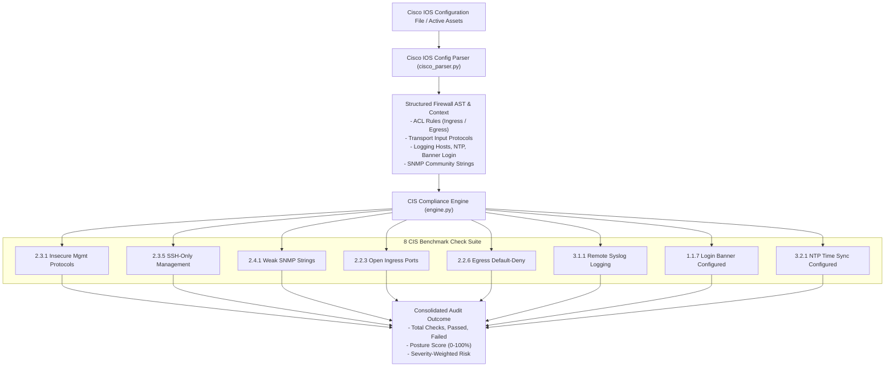

# 04 - CIS Cisco IOS Benchmark Engine & Compliance Checks

## Overview
NetGuard includes an automated compliance engine that maps network discoveries and parsed Cisco IOS access control lists (ACLs) against the official **CIS Cisco IOS 16 Benchmark**. The engine executes 8 deterministic security rules, returning explicit PASS/FAIL statuses, human-readable evidence, severity ratings, affected lines/ports, and exact remediation commands.



## Cisco IOS Parser Architecture (`cisco_parser.py`)

The parser ingests raw Cisco IOS configuration text and extracts structured telemetry:
1. **Standard & Extended ACLs**: Parses `access-list <num> permit|deny <proto> <src> <dst> eq <port>` and named ACLs (`ip access-list extended <name>`).
2. **Wildcard Mask Inversion**: Converts Cisco inverted wildcard masks (e.g. `0.0.0.255`) into standard CIDR prefixes (`/24`) using bitwise inversion.
3. **Directional Interface Mapping**: Correlates ACL rules with interfaces (`interface GigabitEthernet0/0`) and directional tags (`ip access-group <name> in|out`).
4. **Global System Directives**: Extracts `banner login`, `logging host <ip>`, `ntp server <ip>`, `snmp-server community <string>`, and `transport input <protocols>`.

## Detailed CIS Benchmark Check Specifications

### 1. Insecure Management Protocols (`check_insecure_mgmt_protocols`)
* **CIS Reference**: Recommendation 2.3.1
* **Severity**: High
* **Audit Objective**: Ensure legacy, unencrypted management protocols (Telnet port 23, FTP port 21, HTTP port 80, SNMPv1/v2c) are not enabled on network devices or accessible in firewall ACLs.
* **Failure Condition**: Any discovered host running Telnet/FTP/HTTP or any ACL permitting unencrypted management traffic.
* **Compliant Configuration**:
  ```cisco
  line vty 0 4
   transport input ssh
  no ip http server
  ```
* **Non-Compliant Configuration**:
  ```cisco
  line vty 0 4
   transport input telnet
  ip http server
  ```
* **Remediation Commands**:
  ```cisco
  line vty 0 4
   transport input ssh
  no ip http server
  ```

### 2. SSH-Only Dedicated Management Subnet (`check_ssh_only_mgmt`)
* **CIS Reference**: Recommendation 2.3.5
* **Severity**: High
* **Audit Objective**: Ensure SSH is the only allowed remote management transport and remote administrative access is restricted exclusively to authorized management subnets (e.g. `10.10.0.0/24`).
* **Failure Condition**: `transport input` permits `telnet` or `all`, or SSH is accessible from non-management CIDRs / wildcard masks.
* **Compliant Configuration**:
  ```cisco
  access-list 10 permit 10.10.0.0 0.0.0.255
  line vty 0 4
   transport input ssh
   access-class 10 in
  ```
* **Remediation Commands**:
  ```cisco
  access-list 10 permit 10.10.0.0 0.0.0.255
  line vty 0 4
   transport input ssh
   access-class 10 in
  ```

### 3. Weak SNMP Community Strings (`check_weak_snmp_community`)
* **CIS Reference**: Recommendation 2.4.1
* **Severity**: High
* **Audit Objective**: Prevent unauthorized SNMP reconnaissance and modification caused by default or trivial community strings.
* **Failure Condition**: Configuration defines SNMP community strings matching `public`, `private`, `cisco`, or `manager`.
* **Remediation Commands**:
  ```cisco
  no snmp-server community public
  no snmp-server community private
  snmp-server community SecureComplexString#2026 RO 10
  ```

### 4. Open Ingress Sensitive Ports (`check_open_ingress_sensitive_ports`)
* **CIS Reference**: Recommendation 2.2.3
* **Severity**: Critical
* **Audit Objective**: Prevent arbitrary internet traffic from reaching sensitive internal ports (22 SSH, 23 Telnet, 3389 RDP, 445 SMB, 3306 MySQL, 5432 PostgreSQL).
* **Failure Condition**: Any ingress ACL rule containing `action=permit`, `source=any`, and `destination_port` matching sensitive ports.
* **Remediation Commands**:
  ```cisco
  no permit tcp any any eq 22
  permit tcp 10.10.0.0 0.0.0.255 any eq 22
  ```

### 5. Explicit Egress Default-Deny (`check_egress_default_deny`)
* **CIS Reference**: Recommendation 2.2.6
* **Severity**: High
* **Audit Objective**: Ensure all outbound (egress) traffic is explicitly controlled and terminated with an explicit default-deny rule (`deny ip any any`).
* **Failure Condition**: Egress ACL permits all traffic or lacks an explicit terminal rule denying `source=any` to `destination=any`.
* **Compliant Configuration**:
  ```cisco
  ip access-list extended OUTBOUND_FILTER
   permit tcp 10.0.0.0 0.255.255.255 any eq 443
   permit tcp 10.0.0.0 0.255.255.255 any eq 80
   deny ip any any
  ```
* **Remediation Commands**:
  ```cisco
  ip access-list extended OUTBOUND_FILTER
   deny ip any any
  ```

### 6. Remote Syslog Logging Configured (`check_remote_syslog_enabled`)
* **CIS Reference**: Recommendation 3.1.1
* **Severity**: Medium
* **Audit Objective**: Ensure security events and audit trails are forwarded off-box to a centralized SIEM or remote syslog server for forensic analysis.
* **Failure Condition**: Absence of any `logging host <ip>` statement in the configuration.
* **Remediation Commands**:
  ```cisco
  logging host 10.10.0.50
  logging trap warnings
  ```

### 7. Login Warning Banner Configured (`check_no_default_credentials_banner`)
* **CIS Reference**: Recommendation 1.1.7
* **Severity**: Low
* **Audit Objective**: Present an explicit legal warning banner to all connecting users notifying them that unauthorized access is prohibited and subject to monitoring.
* **Failure Condition**: Absence of `banner login` or `banner motd` configuration blocks.
* **Remediation Commands**:
  ```cisco
  banner login ^C
  *****************************************************************
  *  UNAUTHORIZED ACCESS TO THIS SYSTEM IS STRICTLY PROHIBITED   *
  *  ALL SESSIONS ARE LOGGED AND MONITORED.                       *
  *****************************************************************
  ^C
  ```

### 8. NTP Server Time Synchronization (`check_ntp_configured`)
* **CIS Reference**: Recommendation 3.2.1
* **Severity**: Medium
* **Audit Objective**: Ensure system clocks are synchronized with trusted authoritative time sources for accurate log correlation during incident response.
* **Failure Condition**: Absence of any `ntp server <ip>` statement.
* **Remediation Commands**:
  ```cisco
  ntp server 10.10.0.1
  ntp server pool.ntp.org
  ```

## Bundled Firewall Profiles for Testing

NetGuard includes two bundled Cisco IOS configuration profiles in `backend/app/firewall/sample_configs/`:
* **`hardened` (`sample_hardened_cisco_ios.cfg`)**: Implements all 8 CIS recommendations — passes 100% of benchmark checks.
* **`sample` (`sample_cisco_ios.cfg`)**: Deliberately insecure configuration containing Telnet, default SNMP `public`, missing banners, missing syslog, and unconstrained ingress — demonstrates all 8 failure modes and evidence generation.
