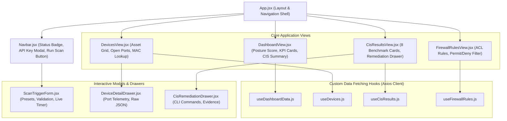

# 06 - Frontend Dashboard & Component Specification

## Overview
The NetGuard frontend is a modern React 18 single-page application (SPA) built with Vite and Tailwind CSS. It connects to the FastAPI backend over HTTP/HTTPS, rendering real-time network telemetry, interactive CIS compliance scorecards, device inspection drawers, firewall rule filters, and live scan execution timers.



## Key Frontend Features & Component Breakdown

### 1. Interactive Scan Trigger Modal (`ScanTriggerForm.jsx`)
* **Real-time Target Validation**: Live regex parsing for IPv4 addresses, comma-separated host lists, and CIDR subnets.
* **Subnet Scope Guard**: Displays an amber warning banner if a subnet between `/24` and `/26` is entered (~64–256 hosts), estimating discovery time. Rejects subnets wider than `/24`.
* **Quick Target Presets**:
  * **Public Cloud Targets**: Cloudflare DNS (`1.1.1.1`), Google DNS (`8.8.8.8`), Quad9 (`9.9.9.9`), Public DNS Pair (`1.1.1.1, 8.8.8.8`). Ideal for verifying the deployed AWS Lambda backend.
  * **Local LAN Targets**: Localhost (`127.0.0.1`), Gateway Node (`192.168.1.1`), Home LAN Subnet (`192.168.1.0/24`), Lab Subnet (`10.10.0.0/24`). Ideal for local offline audits.
* **Multi-Stage Progress Tracker**: Animates through 4 scan phases (Subnet Discovery $\rightarrow$ Port Auditing $\rightarrow$ CIS Engine $\rightarrow$ Data Persistence) with live elapsed seconds.

### 2. Executive Security Dashboard (`DashboardView.jsx`)
* **Posture Score Gauge**: Displays a weighted 0–100% compliance score calculated from passed benchmark checks.
* **KPI Metrics Cards**: Total Active Assets, Discovered Open Ports, Evaluated ACL Rules, and Failed Benchmarks.
* **Persistence Badge**: Dynamically displays storage engine status (e.g. `AWS DynamoDB (us-east-1) • S3 synced` or `Local SQLite`).

### 3. Discovered Assets & Port Telemetry (`DevicesView.jsx`)
* Searchable and paginated table listing all active IP nodes.
* Badges indicating discovered open ports (e.g. `53 DNS`, `80 HTTP`, `443 HTTPS`, `22 SSH`).
* Slide-out **Device Detail Drawer** showing captured HTTP/SSH banners, MAC addresses, and vendor identification.

### 4. CIS Benchmark Scorecard (`CisResultsView.jsx`)
* Grid of all 8 CIS checks with clear `PASS` (Emerald) and `FAIL` (Rose) indicators.
* Displays CIS reference numbers (e.g. `CIS 2.3.5`, `CIS 2.2.6`).
* Slide-out **Remediation Drawer** containing human-readable failure evidence and copyable Cisco IOS CLI remediation commands.

### 5. Firewall Rule Explorer (`FirewallRulesView.jsx`)
* Interactive ACL rule table with filtering by action (`permit` vs `deny`) and direction (`ingress` vs `egress`).
* Formatted source and destination IP/port breakdowns.

## Custom Data Hooks Architecture

All data fetching is abstracted into modular custom React hooks using Axios:
* **`useDashboardData.js`**: Fetches KPI counts, latest scan metadata, and CIS score breakdown.
* **`useDevices.js`**: Fetches active assets with search filtering and pagination tokens (`next_token`).
* **`useCisResults.js`**: Fetches CIS check evaluations with optional `status=PASS|FAIL` filtering.
* **`useFirewallRules.js`**: Fetches parsed ACL rules with `action=permit|deny` filtering.

## Frontend Environment Configuration

In `frontend/.env`:
```env
# For Local Development:
VITE_API_BASE_URL=http://127.0.0.1:8000
VITE_NETGUARD_API_KEY=local-dev-key

# For Production AWS Cloud:
# VITE_API_BASE_URL=https://<YOUR_API_ID>.execute-api.us-east-1.amazonaws.com
# VITE_NETGUARD_API_KEY=your-production-api-key
```

## Building for Production & Hosting

### 1. Build the Optimized Production Bundle:
From the `frontend/` directory:
```powershell
pnpm run build
```
*(Produces static assets in `frontend/dist/`)*.

### 2. Hosting Options:
* **AWS S3 + CloudFront**: Upload `frontend/dist/` to an S3 bucket configured for Static Website Hosting and fronted by AWS CloudFront CDN for global HTTPS distribution.
* **Vercel / Netlify**: Connect your GitHub repository and set the root directory to `frontend/` with build command `pnpm run build` and output directory `dist`.
