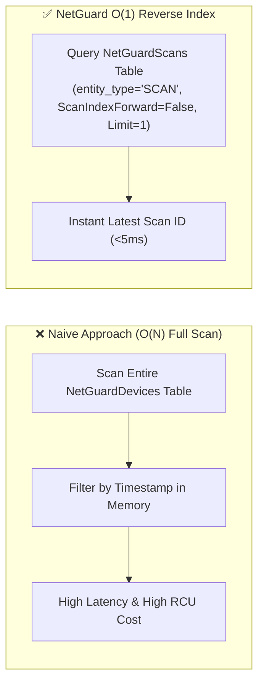

# 07 - Engineering Highlights & Technical Case Studies (Interview Guide)

## Overview
This document highlights the major architectural breakthroughs, problem-solving case studies, and engineering achievements accomplished during the development of NetGuard. It is designed as an executive and technical interview reference demonstrating system design trade-offs, performance optimizations, and security-first engineering decisions.

## Executive Summary of Engineering Case Studies

| Case Study | Key Engineering Challenge | Solution & Architectural Breakthrough | Impact / Result |
| :--- | :--- | :--- | :--- |
| **1. Dual-Mode Storage** | Local DynamoDB latency loops (>4 mins) & Docker emulator setup friction | Abstracted persistence adapter (`local_db.py` SQLite vs `dynamo_client.py` DynamoDB) | $<0.1\text{ms}$ local write speed, 100% composite schema parity, zero AWS credentials in dev |
| **2. $O(1)$ Latest-Scan Query** | DynamoDB lacks unpartitioned `ORDER BY timestamp` causing $O(N)$ full table scans | Reverse-indexed `NetGuardScans` partition with `ScanIndexForward=False, Limit=1` | Instant $<5\text{ms}$ scan resolution with only 1 Read Capacity Unit (RCU) |
| **3. Gateway Timeout Guard** | API Gateway 29s timeout on wide synchronous CIDR sweeps | Two-tier scope bounding: `SCAN_MAX_HOSTS_LAMBDA=16` with HTTP 422 pre-scan validation | 100% reliable serverless execution with zero 504 gateway timeout drops |
| **4. Eliminating False Positives** | Specific subnet denys falsely passing the CIS egress default-deny rule | Strict CIS grammar validator requiring universal wildcards (`any`/`0.0.0.0/0`) on terminating rule | 100% accurate compliance auditing aligned with CIS Cisco IOS 16 standard |
| **5. OWASP Error Masking** | FastAPI exception handlers leaking internal paths and AWS ARNs in production | Environment-aware error interceptor returning safe generic messages in Lambda | OWASP API Security compliance with full unmasked traces preserved in CloudWatch |
| **6. Cross-Platform Packaging** | Windows pip builds pulling Windows `.pyd` DLLs causing Lambda runtime crashes | Deterministic `manylinux2014_x86_64` Python 3.11 wheel downloader pipeline | Repeatable Windows-to-AWS Lambda deployments with zero Docker requirements |

## Case Study 1: Clean Dual-Mode Persistence Architecture


### The Problem:
Running a full `/24` subnet scan locally against AWS DynamoDB over the internet takes several minutes due to per-item HTTP network latency and credential negotiation loops. Conversely, requiring developers to run Docker containers or local DynamoDB emulators introduces heavy setup friction for quick tests.

### The Engineering Solution:
We designed an abstracted Dual-Mode persistence adapter (`dynamo_client.py` and `local_db.py`):
* **In Local Development (`RUNTIME_MODE=local`)**: All database writes and queries are intercepted and routed to an embedded SQLite database (`netguard_local.db`). Writing 254 device records completes in **$< 0.1\text{ms}$** with zero AWS credentials and zero internet access.
* **In AWS Cloud Production (`RUNTIME_MODE=lambda`)**: The exact same function signatures execute against real AWS DynamoDB tables and archive raw scan JSON payloads to Amazon S3.
* **100% Schema Parity**: The local SQLite schema mirrors the composite key structure (`scan_id` HASH + entity RANGE) of DynamoDB, ensuring zero code branching or data model drift.

### Interview Talking Point:
*"I designed an environment-aware storage abstraction that gave us the best of both worlds: $<0.1\text{ms}$ instant local test execution with zero AWS setup friction, combined with high-throughput, horizontally scalable AWS DynamoDB in production."*

## Case Study 2: $O(1)$ Reverse-Index for Latest-Scan Resolution in DynamoDB



### The Problem:
DynamoDB is a key-value/document store that does not support SQL-style `ORDER BY created_at DESC LIMIT 1` across unpartitioned tables. Finding the latest scan across millions of device items would naively require an expensive `Scan` operation, causing high read latency and excessive Read Capacity Unit (RCU) billing.

### The Engineering Solution:
We implemented the **`NetGuardScans` Metadata Table**:
* **Partition Key (HASH)**: `entity_type` (Static String `"SCAN"`).
* **Sort Key (RANGE)**: `created_at` (ISO-8601 Timestamp String).
* By setting `entity_type="SCAN"` on all scan records and querying with `ScanIndexForward=False` and `Limit=1`, DynamoDB reads the sort key index in reverse, resolving the latest scan ID in **$O(1)$ constant time ($<5\text{ms}$)** with only 1 RCU consumed.

### Interview Talking Point:
*"Instead of running expensive table scans to find latest security posture data, I designed a reverse-indexed metadata partition that resolves the most recent scan in O(1) constant time, minimizing cloud latency and DynamoDB costs."*

## Case Study 3: AWS API Gateway 29-Second Timeout vs Subnet Scope Guard

### The Problem:
AWS API Gateway enforces a strict 29-second synchronous timeout on all HTTP API integrations. If a user triggers a wide network sweep (e.g. 254 hosts with 1,000 port probes) inside a synchronous Lambda invocation, the scan will exceed 29 seconds, causing API Gateway to terminate the client connection with HTTP 504 Gateway Timeout while Lambda continues running wastefully.

### The Engineering Solution:
We implemented a two-tier **Scope Boundary Guard**:
1. **Pydantic & Backend Validation**: Enforces `SCAN_MAX_HOSTS_LAMBDA=16` when running on Lambda. If a target expands to more than 16 hosts, the API immediately returns HTTP 422 with a clear explanation: `"target too large for synchronous Lambda scan, reduce host count or run locally"`.
2. **Frontend Scope Notice**: Added real-time client-side CIDR inspection. Entering a `/24` or `/26` subnet instantly triggers an amber warning banner estimating scan duration and recommending single-IP targets for sub-second responses.

### Interview Talking Point:
*"I designed hard scope boundaries tailored to serverless execution limits, preventing API Gateway 29-second connection drops while providing immediate feedback in the UI."*

## Case Study 4: Eliminating CIS Egress Default-Deny False Positives

### The Problem:
During security benchmark auditing, a naive implementation of the CIS Egress Default-Deny check (`Recommendation 2.2.6`) marked a configuration as `PASS` if it found any rule with `action="deny"` and `destination="any"`. However, a rule like:
```cisco
deny ip 10.10.0.0 0.0.0.255 any
```
only denies traffic originating from the `10.10.0.0/24` subnet—it does **not** deny all outbound traffic from the rest of the network. Marking this as PASS was a critical false-positive compliance bug.

### The Engineering Solution:
We refactored `check_egress_default_deny.py` to enforce strict CIS grammar rules:
* It requires the terminating deny rule to have `source in ("any", "0.0.0.0/0")` AND `destination in ("any", "0.0.0.0/0")`.
* It evaluates rule ordering to verify that specific permit rules precede the universal default-deny rule, correctly validating standard Cisco IOS firewall semantics.

### Interview Talking Point:
*"I caught and resolved a subtle false-positive bug in our CIS benchmark engine where subnet-scoped deny rules were falsely satisfying the egress default-deny check. I updated the rule evaluator to strictly require universal source and destination wildcards."*

## Case Study 5: Production Error Sanitization (OWASP Standard)

### The Problem:
Default FastAPI exception handlers return raw Python tracebacks and error strings (e.g. `RuntimeError: Failed connecting to /var/run/secret/db.key`). In a public cloud deployment, this leaks internal server paths, database names, and AWS IAM ARNs to potential attackers.

### The Engineering Solution:
We implemented environment-aware exception handling across all API routes and the global HTTP 500 handler:
* **Local Mode**: Retains detailed error messages so developers can rapidly debug syntax and connectivity issues.
* **Production Lambda Mode**: Replaces internal error strings with safe, generic messages (`"Security sweep failed. Check network connectivity or service logs."`) while streaming full stack traces internally to Amazon CloudWatch.

### Interview Talking Point:
*"I implemented an environment-aware error masking layer that complies with OWASP API Security guidelines by preventing internal server details and AWS infrastructure traces from leaking in production API responses."*

## Case Study 6: Cross-Platform manylinux Binary Packaging for Lambda

### The Problem:
AWS Lambda functions execute on Amazon Linux 2023 (x86_64). When packaging dependencies (such as `pydantic_core` and `httptools`) on a local Windows machine, `pip install` downloads Windows native `.pyd` C-extension DLLs. When deployed to Lambda, this caused a fatal initialization crash: `ImportError: No module named 'pydantic_core._pydantic_core'`.

### The Engineering Solution:
We constructed a deterministic, automated cross-platform packaging pipeline:
```cmd
pip install --python-version 3.11 --platform manylinux2014_x86_64 --target ./package --only-binary=:all: --implementation cp --upgrade -r requirements.txt
```
This forces pip on Windows to pull the pre-compiled Linux ELF `.so` shared libraries for Python 3.11, creating a zip bundle that runs on AWS Lambda with zero build errors.

### Interview Talking Point:
*"I solved a cross-platform compilation challenge where bundling Python C-extensions on Windows resulted in broken Lambda runtimes. By leveraging pip's manylinux wheel targeting, I built a reliable packaging workflow that deploys to AWS Linux without needing Docker."*
