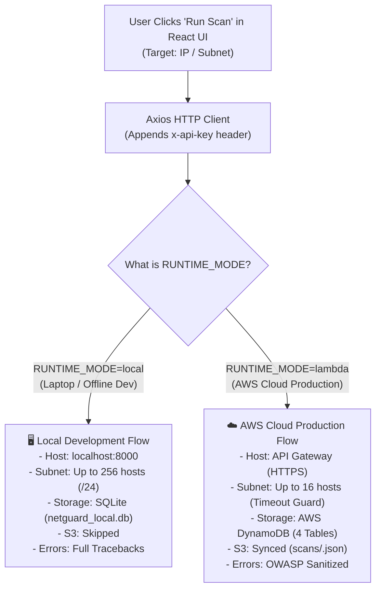
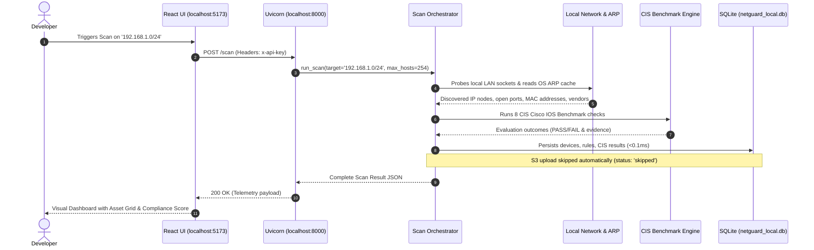
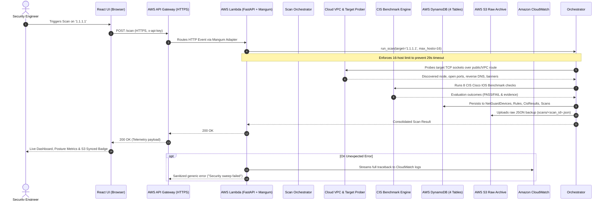

# 08 - Dual-Mode Data Flow & Runtime Execution Guide

## Executive Overview
NetGuard features an intelligent **Dual-Mode Runtime Architecture** governed by the `RUNTIME_MODE` configuration variable (`local` vs `lambda`). This document provides an intuitive, step-by-step technical walkthrough of how data moves through the system in both environments.

## 1. 🖥️ Local Development Mode (`RUNTIME_MODE=local`)

### Mental Model:
Think of Local Mode as a **portable, standalone network security auditor**. It runs directly on your workstation or laptop with zero external dependencies, zero AWS account requirements, and zero internet connectivity.

### Step-by-Step Data Journey in Local Mode:

#### Phase 1: Client Ingress
* The React dashboard dispatches a `POST /scan` request directly to `http://127.0.0.1:8000/scan`.
* The local FastAPI server validates the `x-api-key` header against `NETGUARD_API_KEY` in `backend/.env`.

#### Phase 2: Local Subnet Discovery
* Because the server runs locally on your machine, it has direct access to your physical Wi-Fi or Ethernet network.
* `host_discovery.py` probes candidate IPs across ports `[80, 443, 22, 53, 8080, 8443, 21, 25]`.
* It queries the workstation's local ARP table (using Windows `arp -a` or Linux `arp -an`) to resolve hardware MAC addresses and identify vendors.
* Target limit is bounded by `SCAN_MAX_HOSTS=254` (a full `/24` subnet).

#### Phase 3: CIS Benchmark Evaluation
* `cisco_parser.py` loads and parses the designated Cisco IOS running configuration.
* `benchmarks/engine.py` runs all 8 CIS benchmark checks against the discovered assets and parsed ACLs.

#### Phase 4: Local SQLite Persistence
* `dynamo_client.py` detects `RUNTIME_MODE=local` and routes all database writes directly to `local_db.py`.
* All records are written into `backend/netguard_local.db` in **$< 0.1\text{ms}$**.
* S3 raw archiving is skipped, returning `"s3": "skipped"` in the persistence status.

#### Phase 5: Debug-Friendly Response
* If an error occurs, the server returns the full Python exception string and traceback so the developer can diagnose issues instantly.

## 2. ☁️ AWS Cloud Production Mode (`RUNTIME_MODE=lambda`)

### Mental Model:
Think of Lambda Mode as an **enterprise-grade, serverless cloud compliance engine**. It runs inside isolated AWS microVM containers behind AWS API Gateway, writing to high-throughput cloud storage clusters with zero idle cost.

### Step-by-Step Data Journey in Cloud Mode:

#### Phase 1: Ingress via API Gateway
* The client sends an HTTPS request to `https://<api_id>.execute-api.us-east-1.amazonaws.com/scan`.
* API Gateway HTTP API v2 routes the request payload into the Lambda execution container.
* The `Mangum` ASGI adapter translates the API Gateway proxy event into standard ASGI HTTP requests for FastAPI.

#### Phase 2: Timeout-Guarded Discovery
* To ensure execution stays strictly within API Gateway's 29-second synchronous HTTP limit, `routes_scan.py` enforces `SCAN_MAX_HOSTS_LAMBDA=16`.
* If a target expands to $>16$ hosts, the API immediately halts and returns HTTP 422.
* For valid targets, `host_discovery.py` probes endpoints via non-blocking TCP connect attempts. (Raw ICMP ping is safely bypassed since Lambda sandboxes disallow raw ICMP sockets).

#### Phase 3: CIS Benchmark Evaluation
* The exact same compliance engine runs inside Lambda, evaluating the 8 CIS checks against the cloud target.

#### Phase 4: Cloud Persistence & S3 Archival
* `dynamo_client.py` uses the official AWS SDK (`boto3`) with temporary IAM credentials provided by the Lambda execution role (`NetGuardLambdaRole`).
* It writes records across 4 DynamoDB tables:
  * `NetGuardDevices`: Active IP nodes and open port lists.
  * `NetGuardFirewallRules`: Parsed Cisco IOS ACL rules.
  * `NetGuardCisResults`: 8 benchmark evaluations.
  * `NetGuardScans`: Reverse-indexed metadata partition providing instant $O(1)$ latest-scan resolution.
* `s3_client.py` streams the full raw JSON scan result into the private S3 bucket (`s3://netguard-raw-results-<account_id>/scans/<scan_id>.json`) and reports `"s3": "synced"`.

#### Phase 5: OWASP Error Sanitization & CloudWatch Logging
* If an unexpected error occurs during scanning or database writes, the API masks internal implementation details and returns a safe generic string (`"Security sweep failed. Check network connectivity or service logs."`).
* The complete unmasked stack trace is streamed securely to **Amazon CloudWatch Logs** (`/aws/lambda/NetGuardScanner`).

## 3. Side-by-Side Architecture Comparison

| Feature Dimension | 🖥️ Local Dev Mode (`RUNTIME_MODE=local`) | ☁️ AWS Cloud Production Mode (`RUNTIME_MODE=lambda`) |
| :--- | :--- | :--- |
| **Server Engine** | Local Uvicorn ASGI server on `localhost:8000` | AWS API Gateway HTTP API + AWS Lambda (`python3.11`) |
| **Primary Database** | Embedded SQLite database (`netguard_local.db`) | AWS DynamoDB (4 On-Demand Tables with Pay-Per-Request) |
| **Raw Result Archival** | Skipped (`"s3": "skipped"`) | Synced to private AWS S3 bucket (`"s3": "synced"`) |
| **Target Scope Limit** | Up to 256 hosts (`/24` subnet) | Up to 16 hosts (Strict 29s timeout guard) |
| **Network Reach** | Local Wi-Fi / Physical LAN / Subnet / Loopback | Cloud VPC Subnets / Elastic IPs / Public Internet Endpoints |
| **Hardware MAC Lookup**| Reads physical workstation OS ARP table | Skipped / Virtual ENI addresses |
| **AWS Credentials** | Zero credentials required (Runs 100% offline) | Temporary credentials via IAM Execution Role |
| **Client Error Policy** | Detailed Python exception string & trace | OWASP Sanitized generic error message |
| **Diagnostic Logging** | Local terminal stdout/stderr | Amazon CloudWatch Logs (`/aws/lambda/NetGuardScanner`) |
| **Standing Cost** | $0.00 (Runs on local hardware) | $0.00 (100% within AWS Free Tier allowance) |
