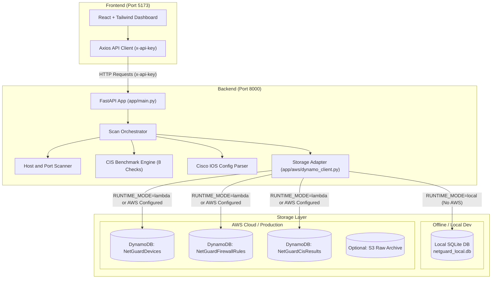
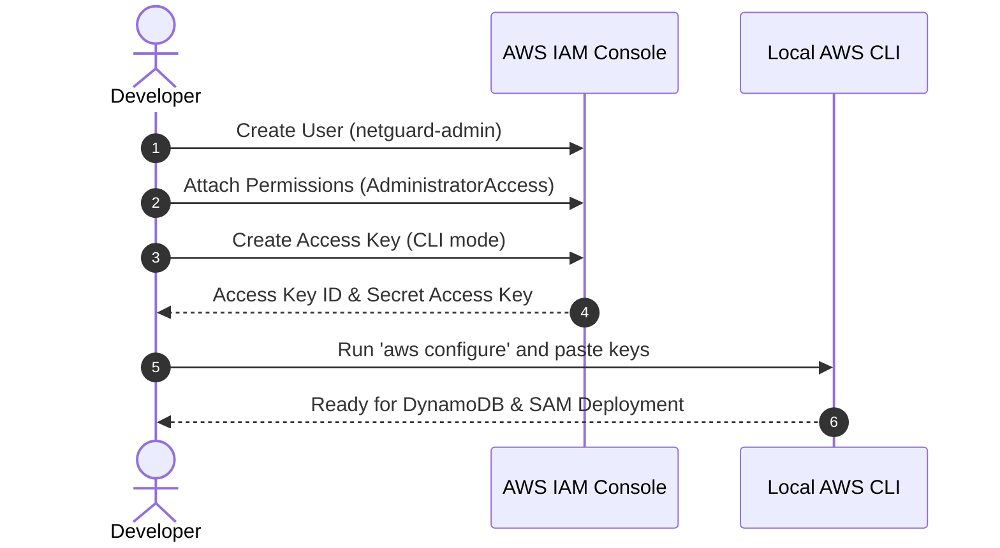

# NetGuard - Complete Architecture & AWS Setup Guide

Welcome to the **NetGuard** setup and architecture guide. This document explains how NetGuard works, how the dual-storage system operates, and gives you step-by-step instructions to set up AWS DynamoDB and run the project both locally and in the cloud.

## 1. System Architecture

NetGuard consists of a **React + Vite Dashboard** (Frontend), a **FastAPI Engine** (Backend), and a **Smart Dual-Storage Layer** (SQLite locally or AWS DynamoDB in the cloud).




## 2. The Smart Dual-Storage Strategy

### Why Do We Have Both SQLite and DynamoDB?
* **Zero Friction Local Development**: You can clone the repository, run `run_local.ps1`, and start testing network scans immediately without setting up Docker, AWS accounts, or internet connections.
* **100% Cloud Compatibility**: The local SQLite database uses the **exact same composite key schema** (`scan_id` + sort key) and JSON payloads as DynamoDB.
* **Zero Code Changes Needed for AWS**: When you deploy to AWS Lambda or provide AWS credentials, NetGuard automatically uses AWS DynamoDB.

### DynamoDB Table Schema

| Table Name | Partition Key (HASH) | Sort Key (RANGE) | Billing Mode | Purpose |
|---|---|---|---|---|
| `NetGuardDevices` | `scan_id` (String) | `device_id` (String) | On-Demand (`PAY_PER_REQUEST`) | Stores discovered network hosts, open ports, banners, MACs, and vendors. |
| `NetGuardFirewallRules` | `scan_id` (String) | `rule_id` (String) | On-Demand (`PAY_PER_REQUEST`) | Stores parsed Cisco IOS ACL rules and SNMP policies. |
| `NetGuardCisResults` | `scan_id` (String) | `check_id` (String) | On-Demand (`PAY_PER_REQUEST`) | Stores the 8 CIS benchmark check evaluations (PASS/FAIL and evidence). |


## 3. Step-by-Step: AWS Setup & Getting Credentials

Follow this section to connect your project to real AWS DynamoDB tables and prepare for deployment.

### Step 3.1: Create an IAM User in AWS
1. Open the [AWS Management Console](https://console.aws.amazon.com/).
2. In the top search bar, search for **IAM** and click **IAM**.
3. In the left navigation menu, click **Users** -> click the **Create user** button.
4. Set the User name to: `netguard-admin`.
5. Under **Set permissions**, choose **Attach policies directly**.
6. Select **`AdministratorAccess`** (or attach `AmazonDynamoDBFullAccess`, `AWSLambda_FullAccess`, `AmazonAPIGatewayAdministrator`, and `IAMFullAccess`).
7. Click **Next** -> click **Create user**.



### Step 3.2: Generate CLI Access Keys
1. In the IAM Users list, click on `netguard-admin`.
2. Select the **Security credentials** tab.
3. Scroll to the **Access keys** section and click **Create access key**.
4. Select **Command Line Interface (CLI)**, check the confirmation box, and click **Next**.
5. Click **Create access key**.
6. **Important**: Copy both:
   * **Access key ID** (starts with `AKIA...`)
   * **Secret access key** (longer string)
   *(Keep these private and never commit them to Git)*.


### Step 3.3: Configure AWS CLI on Your Machine
1. Open **PowerShell** on your computer.
2. If you don't have AWS CLI installed, install it:
   ```powershell
   winget install Amazon.AWSCLI
   ```
   *(Restart PowerShell after installation)*.
3. Run the configuration command:
   ```powershell
   aws configure
   ```
4. Enter your details when prompted:
   * `AWS Access Key ID`: *(Paste your Access Key ID)*
   * `AWS Secret Access Key`: *(Paste your Secret Access Key)*
   * `Default region name`: `us-east-1`
   * `Default output format`: `json`
5. Verify the connection:
   ```powershell
   aws sts get-caller-identity
   ```
   If it returns your `Account` and `Arn`, you are connected!


### Step 3.4: Create the DynamoDB Tables

You have two choices to create the DynamoDB tables in AWS:

#### Option A: Automatic Creation via AWS SAM (Recommended)
From the root of your project:
```powershell
cd backend
sam build
sam deploy --guided
```
This reads `backend/template.yaml` and provisions all 3 DynamoDB tables, Lambda, and API Gateway automatically.

#### Option B: Manual Creation via AWS Web Console
If you want to create only the tables first:
1. Open the [DynamoDB Console](https://console.aws.amazon.com/dynamodbv2/).
2. Click **Create table** and create the 3 tables:

* **Table 1:**
  * Table name: `NetGuardDevices`
  * Partition key: `scan_id` (String)
  * Sort key: `device_id` (String)
  * Table settings: **Default settings** (On-demand)

* **Table 2:**
  * Table name: `NetGuardFirewallRules`
  * Partition key: `scan_id` (String)
  * Sort key: `rule_id` (String)
  * Table settings: **Default settings** (On-demand)

* **Table 3:**
  * Table name: `NetGuardCisResults`
  * Partition key: `scan_id` (String)
  * Sort key: `check_id` (String)
  * Table settings: **Default settings** (On-demand)


## 4. How to Run NetGuard Locally

### 4.1 Start the Backend
Open a terminal in the project:
```powershell
cd F:\_Code\NetGuard\backend
.\run_local.ps1
```
* Backend starts at: `http://localhost:8000`
* Interactive API Documentation (Swagger): `http://localhost:8000/docs`
* Health check: `http://localhost:8000/health`

### 4.2 Start the Frontend
Open a second terminal:
```powershell
cd F:\_Code\NetGuard\frontend
pnpm dev
```
* Dashboard is live at: `http://localhost:5173`


## 5. Testing the Full Flow

1. Open `http://localhost:5173` in your web browser.
2. Click **Run Scan** in the top right corner.
3. Enter a target subnet (e.g. `192.168.1.0/24` or `127.0.0.1` or `10.10.0.0/24`).
4. Click **Start Scan**:
   * The backend discovers active devices and scans open ports.
   * Parses the Cisco IOS firewall rules.
   * Runs the 8 CIS benchmark security checks.
   * Saves the results to storage (SQLite locally, or DynamoDB if connected).
   * Displays the interactive results across the **Dashboard**, **Devices**, **Firewall Rules**, and **CIS Results** pages.


## 6. Project Directory Map

```
NetGuard/
├── docs/
│   └── setup_and_architecture_guide.md   <-- You are here!
├── backend/
│   ├── app/
│   │   ├── api/                          <-- REST API routes (/scan, /devices, etc.)
│   │   ├── aws/
│   │   │   ├── dynamo_client.py          <-- Smart DynamoDB client (with auto-fallback)
│   │   │   ├── local_db.py               <-- SQLite offline engine (netguard_local.db)
│   │   │   └── s3_client.py              <-- Raw JSON archive client
│   │   ├── benchmarks/                   <-- 8 CIS Cisco IOS benchmark checks
│   │   ├── firewall/                     <-- Cisco IOS ACL parser & sample configs
│   │   ├── orchestrator/                 <-- Scan workflow coordinator
│   │   ├── scanners/                     <-- Host, Port, ARP, and Service scanners
│   │   └── main.py                       <-- FastAPI application entrypoint
│   ├── .env                              <-- Backend configuration & API keys
│   ├── run_local.ps1                     <-- Windows PowerShell quick launcher
│   └── template.yaml                     <-- AWS SAM infrastructure template
└── frontend/
    ├── src/                              <-- React dashboard components & hooks
    ├── .env                              <-- Frontend API URL and key settings
    └── package.json
```
